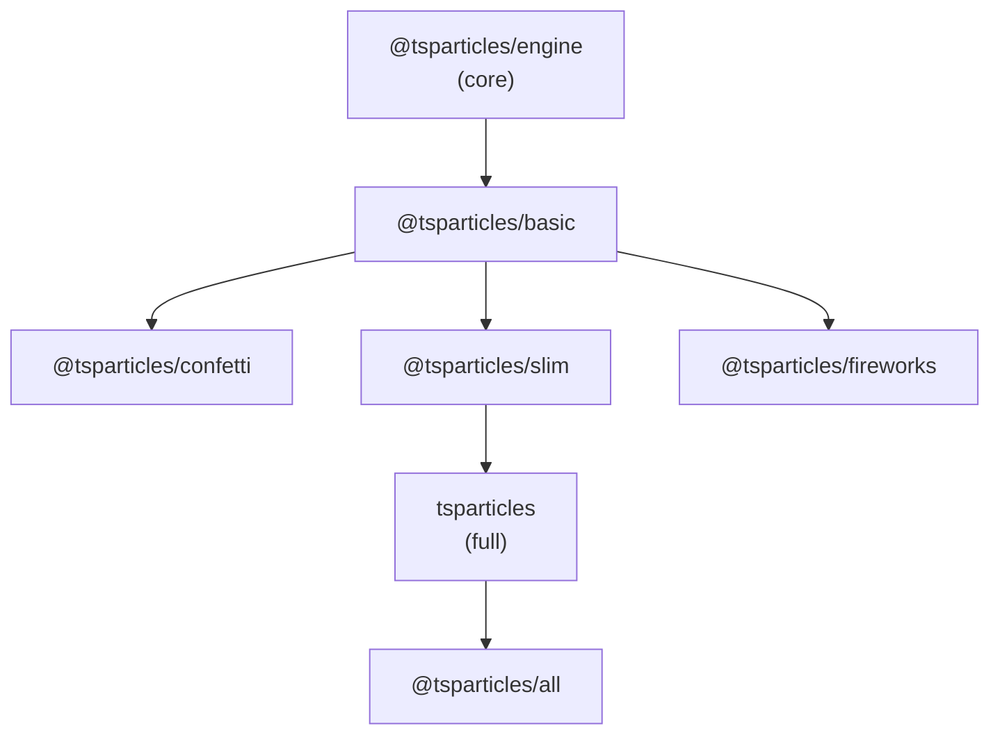

The `@tsparticles/engine` package contains only the rendering loop and the plugin system — no shapes, colours, or interactions are built in. Bundles are collections of plugins pre-wired together so you don't have to register each one manually.

## Bundle hierarchy

Bundles are cumulative: each one includes everything from the bundles below it.



<Note>
  `@tsparticles/confetti` and `@tsparticles/fireworks` both build on `@tsparticles/basic` but are independent of `@tsparticles/slim`. The `tsparticles` full bundle builds on `@tsparticles/slim`.
</Note>

---

## Bundles in detail

### `@tsparticles/basic`

The smallest usable bundle. Loads the minimum set of features needed to display coloured dots moving around a canvas.

**When to use:** you need the lightest possible bundle and will add further plugins yourself, or you only need simple moving dots.

**npm package:** `@tsparticles/basic`

**Included plugins:**

- `@tsparticles/engine`
- `@tsparticles/plugin-move` — particle movement
- `@tsparticles/plugin-hex-color`, `@tsparticles/plugin-hsl-color`, `@tsparticles/plugin-rgb-color` — colour parsing
- `@tsparticles/shape-circle` — circle shape
- `@tsparticles/updater-fill-color` — fill colour animation
- `@tsparticles/updater-opacity` — opacity animation
- `@tsparticles/updater-out-modes` — boundary behaviour (bounce, out, destroy, etc.)
- `@tsparticles/updater-size` — size animation

<CodeGroup>

```bash npm
npm install @tsparticles/basic
```

```bash yarn
yarn add @tsparticles/basic
```

```bash pnpm
pnpm install @tsparticles/basic
```

</CodeGroup>

```javascript
import { tsParticles } from "@tsparticles/engine";
import { loadBasic } from "@tsparticles/basic";

(async () => {
  await loadBasic(tsParticles);

  await tsParticles.load({
    id: "tsparticles",
    options: {
      particles: {
        number: { value: 50 },
        color: { value: "#ffffff" },
        move: { enable: true, speed: 2 },
      },
    },
  });
})();
```

---

### `@tsparticles/confetti`

Everything in `@tsparticles/basic` plus the plugins required for confetti-style animations. Also exposes a `confetti()` function that is a drop-in replacement for the popular `canvas-confetti` library.

**When to use:** you want to launch a confetti burst or any emitter-driven animation without needing the full interaction system.

**npm package:** `@tsparticles/confetti`

**Adds over basic:**

- `@tsparticles/plugin-emitters` — spawns particles over time from defined areas
- `@tsparticles/plugin-motion` — respects `prefers-reduced-motion`
- Shapes: cards, emoji, heart, image, polygon, square, star
- Updaters: life, roll, rotate, tilt, wobble

<CodeGroup>

```bash npm
npm install @tsparticles/confetti
```

```bash yarn
yarn add @tsparticles/confetti
```

```bash pnpm
pnpm install @tsparticles/confetti
```

</CodeGroup>

```javascript
// Simplest possible usage — drop-in confetti() function
import { confetti } from "@tsparticles/confetti";

await confetti();

// With options
await confetti("my-canvas-id", {
  count: 100,
  angle: 90,
  spread: 45,
  startVelocity: 45,
  decay: 0.9,
  gravity: 1,
  drift: 0,
  ticks: 200,
  position: { x: 50, y: 50 },
  colors: ["#ffffff", "#ff0000"],
  shapes: ["square", "circle"],
  scalar: 1,
  zIndex: 100,
  disableForReducedMotion: true,
});
```

<Tip>
  The `confetti()` function accepts the same options as `canvas-confetti`, so you can migrate existing code without changes.
</Tip>

---

### `@tsparticles/slim`

Everything in `@tsparticles/basic` plus a comprehensive set of mouse and particle interactions — the most common choice for interactive particle backgrounds.

**When to use:** you want hover/click interactions (repulse, grab, attract, push, etc.) and linked particles but don't need emitters or absorbers.

**npm package:** `@tsparticles/slim`

**Adds over basic:**

- External interactions: attract, bounce, bubble, connect, grab, parallax, pause, push, remove, repulse, slow
- Particle interactions: attract, collisions, links
- `@tsparticles/plugin-interactivity` — interactivity configuration
- `@tsparticles/plugin-easing-quad` — quad easing for smooth transitions
- Shapes: emoji, image, line, polygon, square, star
- Updaters: life, rotate, stroke-color

<CodeGroup>

```bash npm
npm install @tsparticles/slim
```

```bash yarn
yarn add @tsparticles/slim
```

```bash pnpm
pnpm install @tsparticles/slim
```

</CodeGroup>

```javascript
import { tsParticles } from "@tsparticles/engine";
import { loadSlim } from "@tsparticles/slim";

(async () => {
  await loadSlim(tsParticles);

  await tsParticles.load({
    id: "tsparticles",
    options: {
      particles: {
        number: { value: 80 },
        color: { value: "#ffffff" },
        links: { enable: true, color: "#ffffff", distance: 150 },
        move: { enable: true, speed: 2 },
      },
      interactivity: {
        events: {
          onHover: { enable: true, mode: "repulse" },
          onClick: { enable: true, mode: "push" },
        },
      },
    },
  });
})();
```

---

### `@tsparticles/fireworks`

Everything in `@tsparticles/basic` plus the effects needed to render a fireworks animation — trails, sounds, emitters, and particle lifecycle management.

**When to use:** you want a ready-to-use fireworks effect without the interaction system from Slim.

**npm package:** `@tsparticles/fireworks`

**Adds over basic:**

- `@tsparticles/effect-trail` — particle trail rendering
- `@tsparticles/plugin-emitters` — spawns particles from defined areas
- `@tsparticles/plugin-emitters-shape-square` — square-shaped emitter areas
- `@tsparticles/plugin-sounds` — optional sound effects
- Updaters: destroy, life, rotate

<CodeGroup>

```bash npm
npm install @tsparticles/fireworks
```

```bash yarn
yarn add @tsparticles/fireworks
```

```bash pnpm
pnpm install @tsparticles/fireworks
```

</CodeGroup>

```javascript
import { fireworks } from "@tsparticles/fireworks";

(async () => {
  await fireworks();
})();
```

---

### `tsparticles` (full bundle)

Everything in `@tsparticles/slim` plus absorbers, emitters, additional shapes and updaters. This is the v1-compatible full bundle — if you were using tsParticles v1, this is the bundle to migrate to.

**When to use:** you need absorbers, emitters, the text shape, or any v1 feature not present in Slim.

**npm package:** `tsparticles`

**Adds over slim:**

- `@tsparticles/interaction-external-trail` — draw particles along the mouse trail
- `@tsparticles/plugin-absorbers` — particles that absorb others
- `@tsparticles/plugin-emitters` — particle emitters
- Emitter shapes: circle, square
- `@tsparticles/shape-text` — text/emoji shapes
- Updaters: destroy, roll, tilt, twinkle, wobble

<CodeGroup>

```bash npm
npm install tsparticles
```

```bash yarn
yarn add tsparticles
```

```bash pnpm
pnpm install tsparticles
```

</CodeGroup>

```javascript
import { tsParticles } from "@tsparticles/engine";
import { loadFull } from "tsparticles";

(async () => {
  await loadFull(tsParticles);

  await tsParticles.load({
    id: "tsparticles",
    options: {
      /* full v1-compatible options here */
    },
  });
})();
```

---

### `@tsparticles/all`

The complete tsParticles distribution. Everything in `tsparticles` plus 14 path generators, 4 canvas effects, additional interactions, extended colour spaces, all easing functions, all emitter shapes, export plugins, and many more shapes and updaters.

**When to use:** you need advanced path generators (Perlin noise, curl noise, SVG paths), extended colour spaces, export functionality, or any feature not present in the full bundle.

**npm package:** `@tsparticles/all`

**Adds over tsparticles:**

- Effects: bubble, particles, shadow, trail
- Interactions: particle, pop, light, particle repulse
- 14 path generators: branches, Brownian, curl noise, curves, fractal noise, grid, Lévy, Perlin noise, polygon, random, simplex noise, spiral, SVG, zig-zag
- Extra colour spaces: HSV, HWB, Lab, Lch, named, Oklab, Oklch
- All easing functions: back, bounce, circ, cubic, elastic, expo, Gaussian, linear, quart, quint, sigmoid, sine, smoothstep
- Emitter shapes: canvas, path, polygon
- Export plugins: image, JSON, video
- Additional plugins: background mask, blend, canvas mask, infection, manual particles, motion, Poisson disc, polygon mask, responsive, sounds, themes, trail, zoom
- Additional shapes: arrow, cards, cog, heart, infinity, matrix, path, rounded polygon, rounded rect, spiral, squircle
- Updaters: gradient, orbit

<CodeGroup>

```bash npm
npm install @tsparticles/all
```

```bash yarn
yarn add @tsparticles/all
```

```bash pnpm
pnpm install @tsparticles/all
```

</CodeGroup>

```javascript
import { tsParticles } from "@tsparticles/engine";
import { loadAll } from "@tsparticles/all";

(async () => {
  await loadAll(tsParticles);

  await tsParticles.load({
    id: "tsparticles",
    options: {
      /* all features available */
    },
  });
})();
```

---

## Bundle comparison

| Bundle | npm package | Loader function | Interactions | Emitters | Paths | Colour spaces |
|--------|-------------|-----------------|-------------|----------|-------|---------------|
| Basic | `@tsparticles/basic` | `loadBasic` | None | No | No | Hex, HSL, RGB |
| Confetti | `@tsparticles/confetti` | `confetti()` | None | Yes | No | Hex, HSL, RGB |
| Slim | `@tsparticles/slim` | `loadSlim` | 11 external + 3 particles | No | No | Hex, HSL, RGB |
| Fireworks | `@tsparticles/fireworks` | `fireworks()` | None | Yes | No | Hex, HSL, RGB |
| Full | `tsparticles` | `loadFull` | 12 external + 3 particles | Yes | No | Hex, HSL, RGB |
| All | `@tsparticles/all` | `loadAll` | 13 external + 4 particles | Yes | 14 generators | + HSV, HWB, Lab, Lch, named, Oklab, Oklch |

---

## CDN bundle file names

If you are loading a bundle via a `<script>` tag, use these file names:

| Bundle | CDN file |
|--------|----------|
| Basic | `tsparticles.basic.bundle.min.js` |
| Confetti | `tsparticles.confetti.bundle.min.js` |
| Slim | `tsparticles.slim.bundle.min.js` |
| Fireworks | `tsparticles.fireworks.bundle.min.js` |
| Full | `tsparticles.bundle.min.js` |
| All | `tsparticles.all.bundle.min.js` |

<Warning>
  CDN bundle files expose loader functions as globals (`loadBasic`, `loadSlim`, `loadFull`, `loadAll`, `confetti`). The `tsParticles` engine instance is also exposed as `window.tsParticles`. You must call the loader before calling `tsParticles.load()`.
</Warning>

---

## Next steps

<CardGroup cols={2}>
  <Card title="Quick start" icon="rocket" href="/quickstart">
    See a complete working example using the full bundle.
  </Card>
  <Card title="Framework integrations" icon="puzzle-piece" href="/integrations/react">
    Use bundles with React, Vue, Angular, Svelte, and more.
  </Card>
  <Card title="Configuration options" icon="sliders" href="/configuration/options">
    Learn what you can configure once a bundle is loaded.
  </Card>
  <Card title="Plugins overview" icon="wrench" href="/plugins/overview">
    Go beyond bundles and assemble your own plugin set.
  </Card>
</CardGroup>
